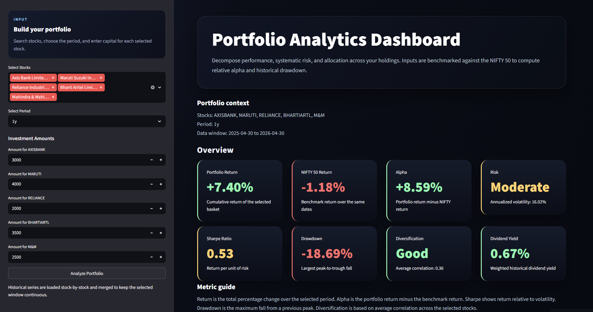
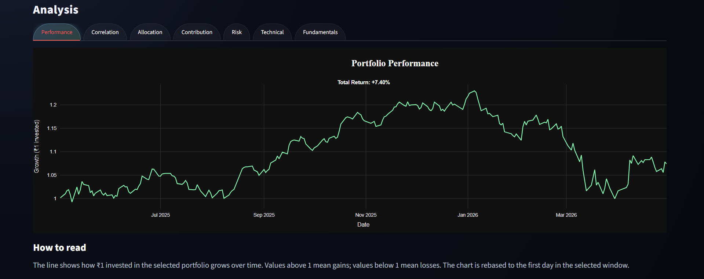
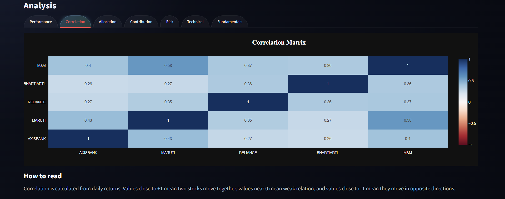
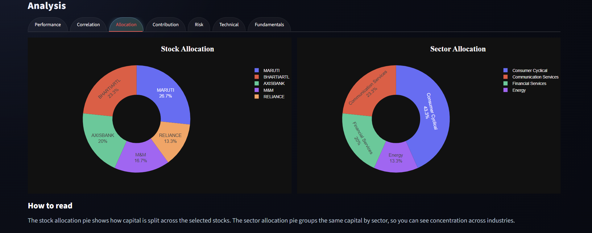
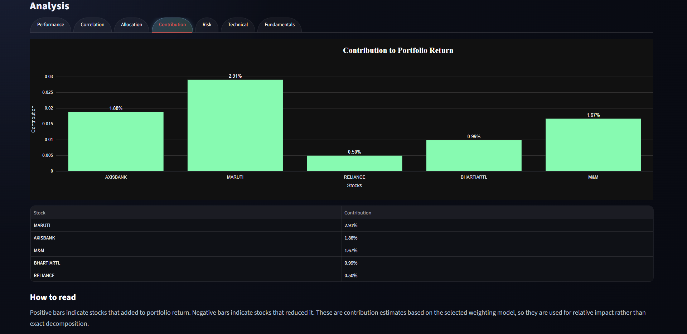
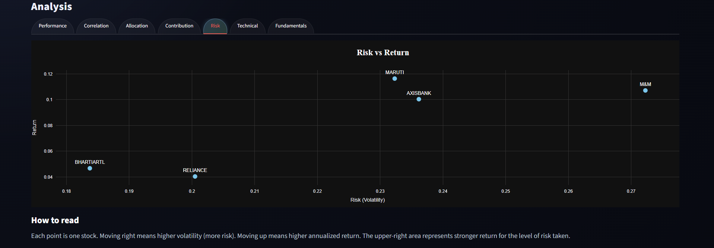
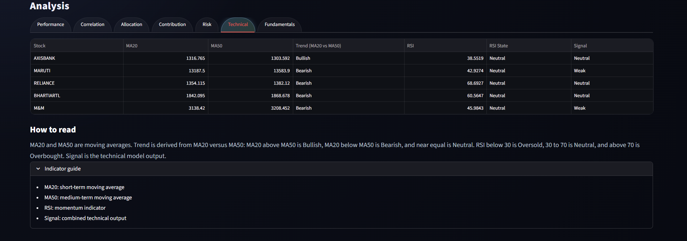
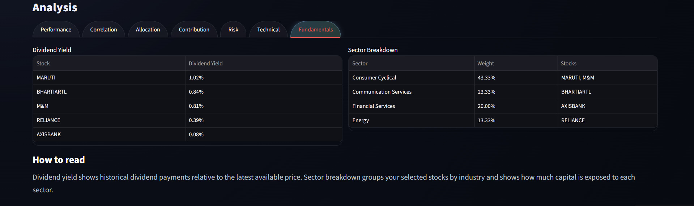

# Portfolio Analytics & Risk Evaluation System

An interactive portfolio analytics system that evaluates stock investments using historical market data. It enables users to allocate capital across selected stocks and analyze performance, risk, diversification, and technical indicators over a chosen time horizon.

## Try the Application

Access the dashboard here:

−> [Portfolio Analytics Dashboard](https://portfolio-analyzer-dashboard.streamlit.app)

## Overview

This project focuses on understanding how a portfolio behaves as a whole rather than analyzing stocks individually. It integrates multiple financial concepts such as returns, risk, diversification, and technical indicators into a single analytical workflow.

The system:

* fetches historical stock price data from Yahoo Finance
* compares portfolio performance with the NIFTY 50 benchmark
* computes key financial metrics
* visualizes insights through charts and structured layouts

## Key Features

* Multi-stock portfolio construction with custom capital allocation
* Benchmark comparison against NIFTY 50
* Portfolio return and growth analysis
* Risk evaluation using volatility and drawdown
* Sharpe ratio and alpha computation
* Diversification analysis using correlation
* Contribution analysis for each stock
* Sector allocation and breakdown
* Dividend yield estimation
* Technical indicators (MA20, MA50, RSI) with signal generation
* Interactive charts and tab-based analysis views

## Tech Stack

* Python
* Pandas
* NumPy
* Plotly
* yfinance

## How It Works

1. Select stocks and assign investment amounts
2. Choose a time period
3. Historical price data is fetched
4. Portfolio-level metrics are computed
5. Results are visualized through charts, tables, and summary cards

## Screenshots


1. **Overview / Dashboard**


    

2. **Performance Analysis**

    

3. **Correlation Analysis**

   

4. **Allocation View**

   

5. **Contribution Analysis**

   

6. **Risk Analysis**

   

7. **Technical Analysis**

   

8. **Fundamentals View**

   


## Folder Structure

```text
Portfolio Analytics/
├── app.py
├── requirements.txt
├── data/
│   ├── nse_stocks.csv
│   └── sector_map.csv
├── analytics/
├── signals/
├── visuals/
└── screenshots/
```

## Local Setup

```bash
pip install -r requirements.txt
streamlit run app.py
```

## Notes

- This application analyzes historical market data and does not provide any future predictions or investment recommendations  
- Results depend on the selected time period and allocation, so different inputs can lead to significantly different insights  
- The analysis reflects past performance, which may not be indicative of future outcomes  
- Some metrics may vary slightly over time due to updates in market data  
- This tool is intended for learning, exploration, and understanding portfolio behavior

## Disclaimer

This project is for educational purposes only and does not constitute financial advice.